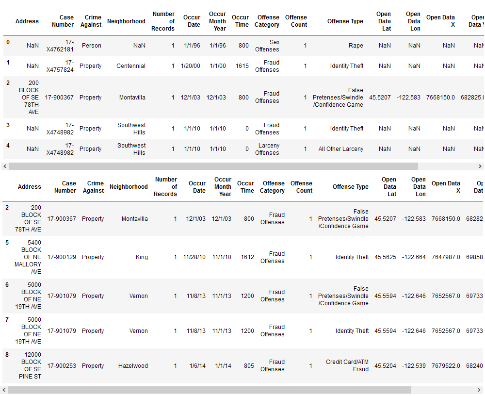

## Unit 4.2 - Exploring Pandas

### Overview

Today's lesson takes dives deeply into Pandas and covers some of the library's more complex functions - like iloc, loc, and grouping - whilst solidifying the concepts from the last class.

### Class Objectives

* Students will understand how to navigate through DataFrames using Loc and Iloc
* Students will understand how to filter and slice Pandas DataFrames
* Students will understand how to create and access Pandas GroupBy objects
* Students will understand how to sort DataFrames

- - -

### Activities Preview

* **Good Movies**

* Files/Instructions:

  

  * [goodMovies_unsolved.ipynb](Activities/02-Stu_GoodMovies/Unsolved/goodMovies.ipynb)

  * [movie_scores.csv](Activities/02-Stu_GoodMovies/Unsolved/Resources/movie_scores.csv)

  * Use Pandas to load and display the CSV provided in `Resources`.

  * List all the columns in the data set.

  * We're only interested in IMDb data, so create a new table that takes the Film and all the columns relating to IMDB.

  * Filter out only the good movies—i.e., any film with an IMDb score greater than or equal to 7 and remove the norm ratings.

  * Find less popular movies that you may not have heard about - i.e., anything with under 20K votes

  * Finally, export this file to a spreadsheet, excluding the index, so we can keep track of our future watchlist.

* **Portland Crime**

* Files/Instructions:

  

  * [PortlandCrime.ipynb](Activities/04-Par_PortlandCrime/Unsolved/PortlandCrime.ipynb)

  * [crime_incident_data2017.csv](Activities/04-Par_PortlandCrime/Unsolved/Resources/crime_incident_data2017.csv)

  * Read in the csv using Pandas and print out the DataFrame that is returned

  * Get a count of rows within the DataFrame in order to determine if there are any null values

  * Drop the rows which contain null values

  * Search through the "Offense Type" column and replace any similar values with one consistent value

  * Create a couple DataFrames that look into one Neighborhood only and print them to the screen

* **Building a PokeDex**

* Files/Instructions:

  

  * [Pokemon.csv](Activities/07-Par_Pokemon/Unsolved/Resources/Pokemon.csv)

  * [pokemon.ipynb](Activities/07-Par_Pokemon/Unsolved/pokemon.ipynb)

  * Read the Pokemon CSV file with Pandas.

  * Create a new table by extracting the following columns: "Type 1", "HP", "Attack", "Sp. Atk", "Sp. Def", and "Speed".

  * Find the average stats for each type of Pokemon.

  * Create a new DataFrame out of the averages.

  * Calculate the total power level of each type of Pokemon by adding all of the previous stats together and place the results into a new column.

  * Bonus: Sort the table by strongest type and export the resulting table to a new CSV

* **Search For the Worst**

* Files/Instructions:

  

  * [SearchForTheWorst.ipynb](Activities/09-Stu_SearchForTheWorst//Unsolved/SearchForTheWorst.ipynb)

  * [Soccer2018Data.csv](Activities/09-Stu_SearchForTheWorst//Unsolved/Resources/Soccer2018Data.csv)

  * Read in the CSV file provided and print it to the screen.

  * Print out a list of all of the values within the "Preferred Position" column.

  * Select a value from this list and create a new DataFrame that only includes players who prefer that position.

  * Sort the DataFrame based upon a player's skill in that position.

  * Reset the index for the DataFrame so that the index is in order.

  * Print out the statistics for the worst player in a position to the screen.

- - -

### Copyright

Trilogy Education Services © 2019. All Rights Reserved.
