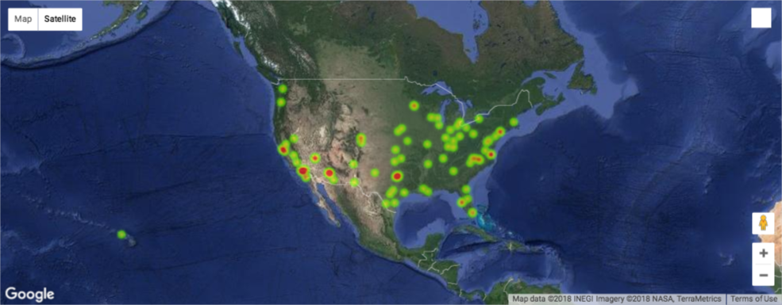

## Unit 6.3 - Bank Deserts

### Overview

In this class, students will be introduced to the Google Maps and Places API as well as Jupyter Gmaps. Using these new tools, along with data from the US Census, students will be tasked with creating visualizations to capture the socioeconomic trend of [banking deserts](http://www.theatlantic.com/business/archive/2016/03/banking-desert-ny-fed/473436/).

### Class Objectives

* Students will be able to successfully use the Google Maps and Places API to obtain information about geographic areas.

* Students will understand how to use the Census API wrapper.

* Students will understand the concept of rate limits and the importance of creating "test cases" prior to running large scripts.

* Students will have a firmer understanding of how to dissect new API documentation.

* Students will be able to visually represent data on a map with Jupyter Gmaps.

- - -

### Activities Preview

* **Google Drills**
* File/Instructions:

  * [04-Stu_Google_Drills/Google_That.ipynb](Activities/03-Stu_Google_Drills/Unsolved/Google_That.ipynb)
  
  * [03-Stu_Google_Drills/README.md](Activities/03-Stu_Google_Drills/README.md)

  * Complete each of the six drills articulated in the code provided. Feel encouraged to look back at the previous examples but know that you will have to consult the Google API documentation.

  * Hints:

    * See the [Google Geocoding Documentation](https://developers.google.com/maps/documentation/geocoding/intro)

    * See the [Google Places Documentation](https://developers.google.com/maps/documentation/javascript/places#place_search_requests)

* **Google Complex (Airport)**
* Files/Instructions:

  * [05-Stu_Google_Complex/Airport_Ratings.ipynb](Activities/05-Stu_Google_Complex/Unsolved/Airport_Ratings.ipynb)

  * [05-Stu_Google_Complex/Cities.csv](Activities/05-Stu_Google_Complex/Resources/Cities.csv)\
  
  * [05-Stu_Google_Complex/README.md](Activities/05-Stu_Google_Complex/README.md)

  * Using [05-Stu_Google_Complex/Airport_Ratings.ipynb](Activities/05-Stu_Google_Complex/Unsolved/Airport_Ratings.ipynb) as a starting point, utilize the Google Geocoding API, the Google Places API, and Python/Jupyter, create a script that lists the "Airport Rating" of the major "International Airport" in each the top 100 metropolitan areas found in [05-Stu_Google_Complex/Cities.csv](Activities/05-Stu_Google_Complex/Resources/Cities.csv).

  * Your final `ipynb` file should contain each of the following headers:

    1. `City`

    2. `State`

    3. `Lat`

    4. `Lng`

    5. `Airport Name`

    6. `Airport Address`

    7. `Airport Rating`

  * Hints:

    * You will need to obtain the lat/lng of each airport prior to sending it through the Google Places API to obtain the rating.

    * When using the Google Places API, be sure to use the term: "International Airport" to ensure that the airport you receive data for is the major airport in the city and not a regional one.

    * Use a try-except to skip airports for which there are no Google user ratings.

* **Hot Airports**
* Files/Instructions:

  * [07-Stu_Airport_Map/Airport_Output.csv](Activities/07-Stu_Airport_Map/Resources/Airport_Output.csv)

  * [07-Stu_Airport_Map/airport_heatmap.ipynb](Activities/07-Stu_Airport_Map/Unsolved/airport_heatmap.ipynb)

  * Using the airport CSV from earlier, create a heatmap of airports across the country.

    * Use the latitude and longitude to place the airport
    * Use the rating to weight the heatmap.

  * Be sure to drop `NaN` values before plotting the dataframe.

  * BONUS

    * Explore the [documentation](http://jupyter-gmaps.readthedocs.io/en/latest/) to  add settings that handles the heatmap dissipating when zooming in.

    * Create two different kinds of map types.

      

      

* **Census Activity**
* Instructions:

  * [09-Stu_Census/README.md](Activities/09-Stu_Census/README.md)

  * Using [09-Stu_Census/Census_States.ipynb](Activities/09-Stu_Census/Unsolved/Census_States.ipynb) as a reference, create a completely new script that calculates each of the following fields at the **state** level:

    1. Population

    2. Median Age

    3. Household Income

    4. Per Capita Income

    5. Poverty Count

    6. Poverty Rate

    7. Unemployment Rate

  * Save the resulting data as a csv.

  * Next, read in the provided csv containing state centroid coordinates and merge this data with your original census data.

  * With the coordinates now appended to the dataframe, you have the ability to add markers to a base map, using the 'Poverty Rate' data to populate the info box.

  * Hints:

    * See documentation for the [Census API Wrapper](https://github.com/datamade/census).

    * See documentation for [Jupyter Gmaps](http://jupyter-gmaps.readthedocs.io/en/latest/tutorial.html) to learn how to add markers.

* **Banking Deserts Heatmap**
* Files/Instructions:

  * [zip_bank_data.csv](Activities/10-Stu_BankDeserts_Heatmap/Resources/zip_bank_data.csv)

  * [Unsolved/Banking_Deserts_HeatMap.ipynb](Activities/10-Stu_BankDeserts_Heatmap/Unsolved/Banking_Deserts_HeatMap.ipynb)

  * In this activity your broad task is to answer the question: "What is the relationship between poverty, age, and population with the number of banks in a given area?" To help accomplish this task, you've been given census data for every zip code across the country.

  * Using [zip_bank_data.csv](Activities/10-Stu_BankDeserts_Heatmap/Resources/zip_bank_data.csv) and your new knowledge of the US Census API, add a column for Unemployment Rate to the csv.

  * Using `gmap` create the following three figures:

    * A map with a `heatmap_layer` of the poverty rate for each city.

    * A map with a `symbol_layer` for the number of banks located at that city.

    * A map that includes both the poverty `heatmap_layer` and the bank `symbol_layer`.

  * Hints:

    * Test your code with only 5-10 cities at a time while debugging.

    * For reference, use the docs for the [layers](http://jupyter-gmaps.readthedocs.io/en/latest/api.html#figures-and-layers) and as a [refresher](http://jupyter-gmaps.readthedocs.io/en/latest/tutorial.html) for setting up the maps.

    * Be sure to handle zoom on the heatmap.

    * At this point, you should not need to perform any new requests to Google's APIs.

    * To format the info boxes on your `symbol_layer`, look to use string formatting with list comprehension.

- - -

### Copyright

Trilogy Education Services © 2019. All Rights Reserved.
