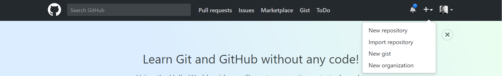

## Unit 7.1 - Projects & Collaboration with Git

### Overview

Today's lesson plan introduces students to the requirements for Project 1, as well as the basics of collaboration with Git.

### Class Objectives

* Students must be able to articulate the requirements for Project 1.
* Students must be able to draw and interpret diagrams of Git branching workflows.
* Students must be able to create new branches with Git.
* Students must be able to push local branches to GitHub.

- - -

### Activities Preview

* **Creating a Project Repo**
* Instructions:

  * We'll next set up a GitHub repository that students can use for their projects.
  
  * Choose _one_ member to follow along with you. This will be the repo that the group shares through projects.
  
  * Go to [GitHub](https://github.com/), and click on the plus button in the top right to create a new repo.

  

    * Fill out the fields on the new repo page.

    * Students _should_ initialize with a `.gitignore`.

    * Students should choose `Python` in the gitignore dropdown.

    

    * This is sufficient to create a repository that everyone can share.

  * Students in charge of creating their group's repository to slack the remote URL (i.e., the link to the repo) to their teammates.

    * Team members will `git clone` this link.

  * By default, only the creator of the repo can push changes.

  * "Open up" the repo by adding **collaborators**.

    * Navigate to the repository settings.

    

    * Navigate to the collaborators tab, and enter your password when prompted.

    

    * From here, students can search for their teammates by username.

    

    * Everyone in each group should now be able to make changes to the shared repo.

  * _everyone in the group must clone the new repository_

* **Workflows**
* Instructions: [Activities/02-Stu_Workflows/README.md](Activities/02-Stu_Workflows/README.md)
  
* **Creating Branches**
* Files:

  * [Activities/03-Ins_Branches/Solved/BranchDemo.md](Activities/03-Ins_Branches/Solved/BranchDemo.md)
  
  * Explain the notion of branching.

  * Provide two benefits of branching.

  * Navigate into the project directory they just cloned from GitHub.

  * Step through each uncommented line in the BranchDemo File.

    * First create a new file, and commit it on the `master` branch.

    * Next create and **checkout** a new branch, on which to work on our data analysis.

    * Students should add their name as a prefix when they create this branch, e.g.: `<student name>/data_analysis`.

  * We can then commit files on this branch, _without affecting the code on `master`_.

    * Ask a student to explain the difference between the code on `master` and that on `data_analysis`.

    * Add and commit a text file containing their name to their new branch.

  * After working on the `data_analysis` branch, we can checkout master; update it with our changes to `data_analysis`; and then delete the `data_analysis` branch, if we don't plan to work on it anymore.

    * Deleting branches like this isn't necessary.

* **Pushing to GitHub**
* Instructions:

  * Up until now, students' `data_analysis` branches aren't visible to their teammates—there's no way for their group members to see the work they've done.

  * In order to share work we do on branches, we can **push** code to from our computers to GitHub, after which our teammates can **pull** it from GitHub to their computers.

  * There are two steps to push our local branch to GitHub.

    * First, checkout the branch we want to push to GitHub

    * Then, run: `git push origin <branch_name>`

    * Run this line to push their local branches to their shared repository.

  * That pushes your local branch to GitHub, allowing your teammates to get access to it later.

  * After students have pushed to GitHub, checkout master, and then:

    * First, run `git pull`

    * Then, run `git checkout <branch_name>`, where `<branch_name>` is the name of one of their teammates' branches.

    * Verify that the code you checked out does indeed come from your teammate's branch.

  * This allows us to easily share different versions of our code across workstations, and allows us to easily test those versions on our local computers.

- - -

### Copyright

Trilogy Education Services © 2019. All Rights Reserved.
