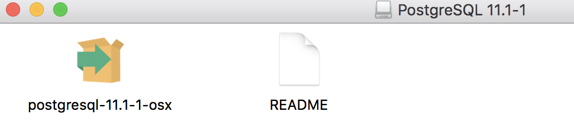
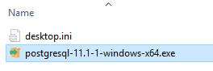
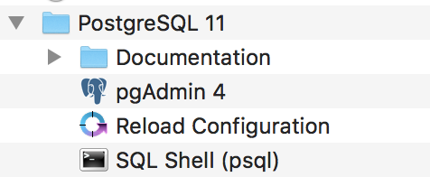
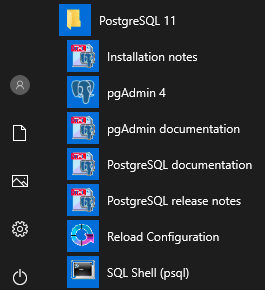
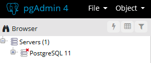
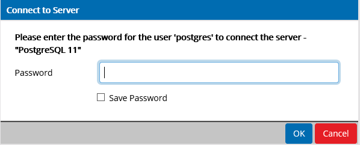

## Unit 8.1 - Install PostgreSQL and pgAdmin

### Overview

During this lecture, most of class will center on project work.

- - -

### Activities Preview

* **Install Postgres**
* Files/Instructions:

  * [pgAdmin_and_Postgres_for_Mac.md](Activities/01-Evr_Installations/Resources/pgAdmin_and_Postgres_for_Mac.md)

  * [pgAdmin_and_Postgres_for_Windows.md](Activities/01-Evr_Installations/Resources/pgAdmin_and_Postgres_for_Windows.md)

  * [Installation videos for Mac and Windows](https://github.com/coding-boot-camp/DataViz-Lesson-Plans/blob/copyedit/issue-2964/sql-day-1/01-Lesson-Plans/09-SQL/VideoGuide.md)

  * You will need to install a coding environment capable of executing SQL queries.

  * Installation:

    * Visit the download link for [PostgreSQL](https://www.enterprisedb.com/downloads/postgres-postgresql-downloads) and select the operating system appropriate for your machine.

    * After the file has been downloaded, Mac users will click on the `postgresql-11.1-1-osx` file.

    

    * Windows users will click on the `postgresql-11.1-1-windows-x64.exe` file.

    

    * Navigate through the Setup Wizard and install PostgreSQL. The default location is: `/Library/PostgreSQL/11`.

    * Select the components to be installed. **Be sure to un-check `Stack Builder`**.

    * Mac users will see the following window:
  
    

    * Windows users will see the following window:

    

    * Next, add your Data Directory. The default location is: `/Library/PostgreSQL/11/data`.

    * When prompted, enter a password. **Be sure to record this password for future use.**

    * Set default port as `5432` and in the Advanced Options, locale can be set as `[Default locale]`.

    * The final screen will be the `Pre Installation Summary`.

    * Once the installation is complete, Mac users will find a folder in their Applications with these files:

    

    * Windows users will be able to access the same files by clicking the start menu on their computer and scrolling to the `Postgres 11` folder.

    

  * Open pgAdmin, which will open in a new browser tab, and verify that everyone is connected to a local Postgres server before moving on to the next activity.

  

    * Students will need to input their password to connect to the server.

    

    * Note: If the computer seems non-responsive when starting pgAdmin, quickly reboot the machine and try again.

* **Project Work**

- - -

### Copyright

Trilogy Education Services © 2019. All Rights Reserved.
