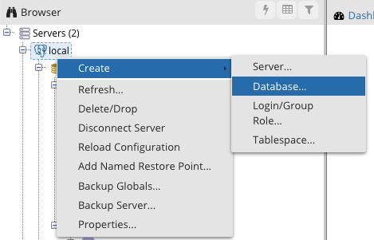

## Unit 9.1: Introduction to SQL

### Overview

In today's class, students will be introduced to SQL databases and will learn how to create tables and simple queries.

### Class Objectives

By the end of class, students will be able to:

- Install and run Postgres and pgAdmin on their computers.
- Create a database and tables using pgAdmin.
- Define SQL data types, primary keys, and unique values.
- Load CSV files into a database and query the data.
- Articulate the four basic functions of persistent storage (CRUD) and apply this set of functions to a database.
- Combine data from multiple tables using JOINs.

- - -

### Activities Preview

* **Create a Database**

* Instructions:

  * Open pgAdmin in a new browser window, ensure that you can view your new server in the browser.

    

  * Here are the steps to create a database using pgAdmin.

    * In the pgAdmin editor, right-click the newly established server to create a new database.

    * From the menu, select **Create**, and then select **Database** to create a new database.

    

    * Enter **animals_db** as the database name. Make sure the owner is set as the default postgres, and then click **Save**.

    

  * At this point, there should be a new database listed in the left-hand menu. The new database, `animals_db`, is not yet connected to the server. Simply clicking on the database will create a connection to Postgres.

    

* **Creating Tables**

* Instructions:
  
  * [README.md](Activities/03-Stu_Creating_Tables/README.md)

* **Making and Using an ID**

* Instructions:
  
  * [README.md](Activities/05-Stu_Making_IDs/README.md)

* **Hide and Seek**

* Files/Instructions:

  * [WordAssociation_AC.csv](Activities/07-Stu_Hide_and_Seek/Resources/WordAssociation_AC.csv)

  * [WordAssociation_BC.csv](Activities/07-Stu_Hide_and_Seek/Resources/WordAssociation_BC.csv)

  * [README.md](Activities/07-Stu_Hide_and_Seek/README.md)

* **Using CRUD**

* Files/Instructions:

  * [schema.sql](Activities/08-Stu_CRUD/Resources/schema.sql)

  * [GlobalFirePower.csv](Activities/08-Stu_CRUD/Resources/GlobalFirePower.csv)

  * [README.md](Activities/08-Stu_CRUD/README.md)

    * You will be using the `WHERE` clause in this activity.

    * This activity will require you to do some research. Links are provided to help them search for solutions to problems you are likely to encounter.

* **Joining the NBA**

* Files/Instructions::

  * [Players.csv](Activities/10-Stu_Joins/Resources/Players.csv)

  * [Seasons_Stats.csv](Activities/10-Stu_Joins/Resources/Seasons_Stats.csv)

  * [schema.sql](Activities/10-Stu_Joins/Resources/schema.sql)
  
  * [README.md](Activities/10-Stu_Joins/README.md)

- - -

### Copyright

© 2019 Trilogy Education Services
