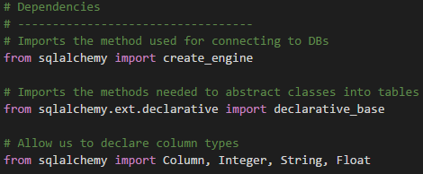
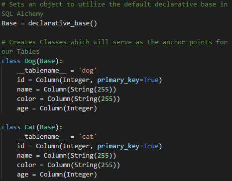
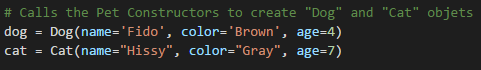
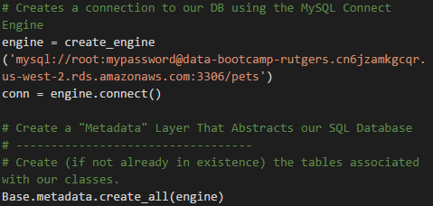
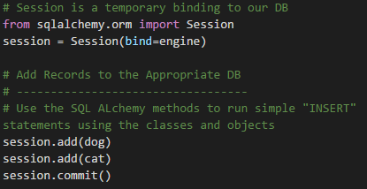
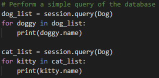

## Unit 10.1 - Introduction to SQLAlchemy

### Overview

Today's lesson will introduce students to the SQLAlchemy library for Python.

### Class Objectives

* Students will  be able to connect to a SQL database using SQLAlchemy
* Students will learn to perform basic SQL queries using engine.execute()
* Students will learn how to create Python classes and objects
* Students will  be able to create, read, update, and delete data from a SQL database using SQLAlchemy's ORM

- - -

### Activities Preview

* **Looking Into SQLAlchemy**
* Instructions:

  * What is an ORM?

  * What are the benefits to using an ORM?

  * What are some of the disadvantages to using an ORM?

* **Ice Cream Connection**
* Instructions: [README](Activities/02-Stu_IceCreamStore/README.md)

* **Read All the SQL**
* Instructions: [README](Activities/04-Stu_ReadAllTheSQLs/README.md)

* **Surfer Class**
* Instructions:

  * Create a class `Surfer` that takes in a name, hometown, and rank.

  * Create an instance of a surfer and then print the following from your surfer object: name, hometown and rank.

  * Bonus:

    * Create a while loop that will allow you to keep taking input to create new instances of surfers.

    * Keep the loop going until the user specifies otherwise.

* **Surfer Class Extended**
* Instructions: [README](Activities/09-Stu_Surfer_Class_Extended/README.md)

* **Back to the SQL**
* Instructions:

  * As with most Python code that uses external libraries, the first step is to import in the modules desired.

    * `create_engine` allows SQLAlchemy to create connections to SQL databases.

    * `declarative_base` allows SQLAlchemy to convert the classes created in Python to SQL tables.

    * The different datatypes used in SQL must also be imported into Python from SQLAlchemy. These datatypes are then used when   creating class fields so as to state what datatypes each column in the SQL table should contain.

      

  * The classes created using SQLAlchemy's "Base" class will serve as the anchor points for SQL tables.

    * When creating classes to be used with SQLAlchemy, a `__tablename__` field must be declared and provided with the name of a table. If the table exists, any new objects created will be added into the existing table. If the table does not yet exist, a new table will be created based upon the class' fields.

    * Each field of a SQLAlchemy class must be declared as a column and the datatype of the field must also be provided.

    * A primary key can also be set by using the `primary_key` value and setting it to either True or False.

      

    * Creating instances of SQLAlchemy classes functions almost identically to creating regular Python objects. It is not necessary to declare fields explicitly within the constructor but this is common practice.

      

  * After the SQLAlchemy classes have been made, they can be created on the SQL database by creating a connection engine and then calling `Base.metadata.create_all(engine)`

    * The `create_all` looks through the Python script and checks if the classes declared exist within the database being connected to. If they do not yet exist, the tables will be created at this time.

      

  * SQLAlchemy functions much like Git does in how new rows of data can be added/changed within a SQL table.

    * A SQLAlchemy session is created using the `Session` module and bound to the connection engine.

    * New rows of data can then be staged by creating a new instance of a SQLAlchemy class and passing them into `session.add()` as a parameter.

    * When all of the changes desired have been made, simply use `session.commit()` to push them up to the database.

      

  * Run through the code as many times as needed so as to ensure that the class fully understands how to use SQLAlchemy to add new data/tables to a SQL database.

    * Feel free to point out how simple it is to collect all of the data from a SQL table using SQLAlchemy as well.

    * Simply use `session.query()` and pass the class/table to query in as a parameter. The returned data can then be looped through and printed to the terminal.

      

* **Surfing SQL**
* Instructions:

  * Modify the `Surfer` class created during the previous activity so that it will function with SQLAlchemy.

    * `__tablename__` should be "surfers"
    * `surfer_id` should be an integer and the primary key
    * `name` should be a string capable of holding 255 characters
    * `hometown` should be a string capable of holding 255 characters
    * `rank` should be an integer

  * Create a new class called `Board` which will function with SQLAlchemy and has the following parameters...

    * `__tablename__` should be "surfboards"
    * `id` should be an integer and the primary key
    * `surfer_id` should be an integer that references a surfer_id in the "surfers" column
    * `board_name` should be a string capable of holding 255 characters
    * `color` should be a string capable of holding 255 characters
    * `length` should be an integer

  * Pull a list of all of the surfers and surfboards already inside the database

  * Push a new surfer and surfboard to the tables on the database

- - -

### Copyright

Trilogy Education Services (C) 2019. All Rights Reserved.
