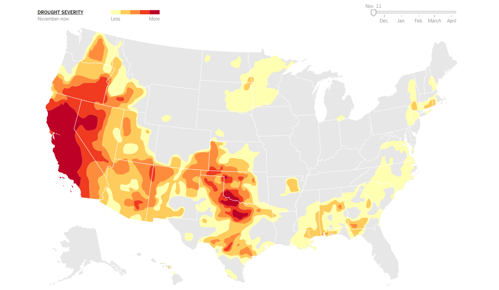
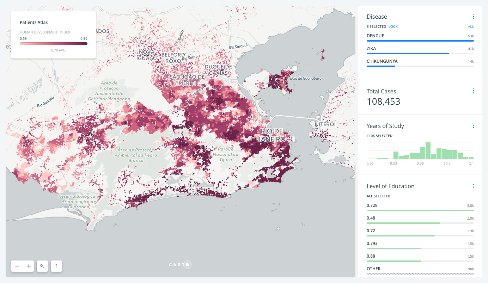
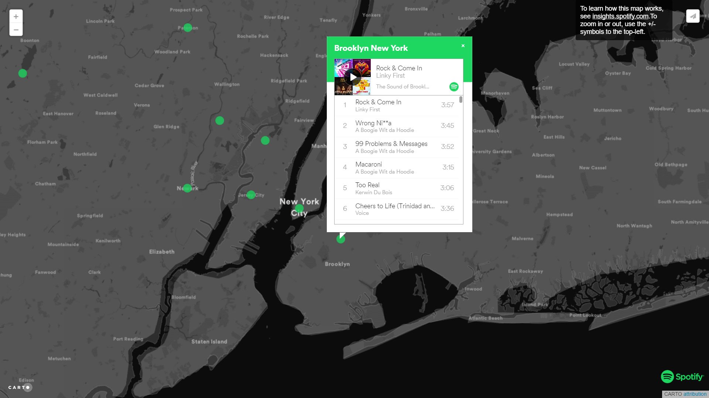

## Unit 17.1: Data Visualization with Leaflet

### Overview

Today's lesson will be spent introducing students to data visualization with maps. Students will gain a basic understanding of the Leaflet.js mapping library before diving headfirst into a number of increasingly involved examples.

### Class Objectives

* Students will understand the benefits that visualizing data with maps can provide.

* Students will learn the basics of creating maps and plotting data with the Leaflet.js library.

* Students will gain an understanding of the GeoJSON format.

* Students will understand the concept of layers and layer controls and how we can use them to add interactivity to our maps.

- - -

### Analytics Preview

* **Career_Services**
* Files: [Slides](../../Supplimentary-Material/Career-Services.pdf)

* **Project 2 Introduction**
* Files: [Slides](../../19-Project-2/data-18-1-project-2.pdf)

* **Why visualize data in a geographical context?**
* Useful Links:

  * Sample Visualizations
    * [Mapping the Spread of Drought Across the U.S.](https://www.nytimes.com/interactive/2014/upshot/mapping-the-spread-of-drought-across-the-us.html?_r=0)

        

    * [Understand and Predict Zika In Brazil With Spatial Analysis](https://carto.com/blog/understand-and-predict-zika-in-brazil)

        

    * [Spotify - Musical Map of the World](https://insights.spotify.com/us/2016/12/07/musical-map-of-the-world-2-0/)

        
  
  * Leaflet: [Leaflet.js web-page](http://leafletjs.com/)
  
* **Quick Labeling Exercise**
* Instructions: [README](Activities/03-Stu_City_Markers/README.md)

* **Other Types Of Markers**
* Instructions: [README](Activities/05-Stu_Other_Markers/README.md)

* **World Cup Visualized**
* Instructions: [README](Activities/07-Stu_Country_World_Cup/README.md)

* **Layer Activity**
* Instructions: [README](Activities/09-Stu_City_Population_Layers/README.md)

* **GeoJSON activity**
* Instructions: [README](Activities/10-Stu_Geo-Json/README.md)

- - -

### Copyright

Trilogy Education Services © 2019. All Rights Reserved.
