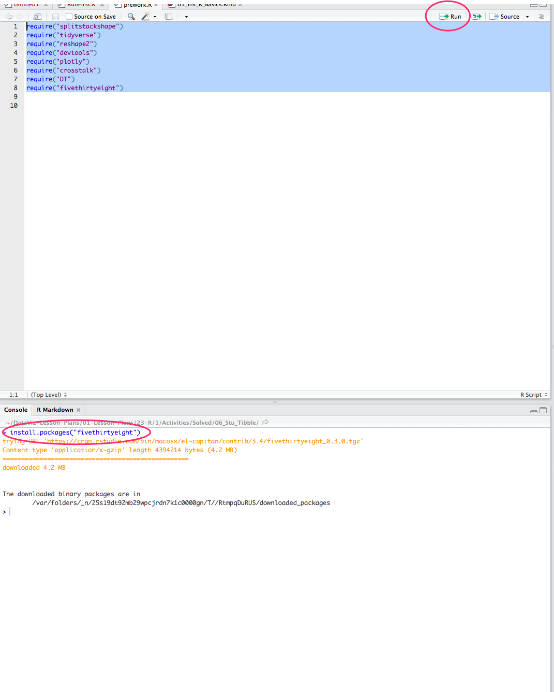

## 18.1: R We There Yet

### Overview

Today's class will be a relatively short, but an impactful introduction to R. Despite some substantial differences, it shares many similarities with Python. By the end of the lesson, students will be able to leverage their knowledge of Python and pandas into revisiting data analysis tasks they performed in the fourth week, this time in R.

### Class Objectives

* Students will learn the basics of R syntax.

* Students will learn the fundamental R data types.

* Students will gain familiarity with RStudio.

* Students will learn how to create tibbles.

* Students will be able to manipulate data in tibbles.

* Students will be able to compare and contrast the features of Python and R.

- - -

### Activities Preview

* **PreWork: Install RStudio**
* **File/Instructions:

  * RStudio is an Integrated Development Environment, which includes all the tools required to program in R.
  
  * R Keyboard Shortcuts: [this link to R keyboard shortcuts](https://support.rstudio.com/hc/en-us/articles/200711853-Keyboard-Shortcuts).

  * The download page for their respective operating system: [R for Mac OSX](https://cran.r-project.org/bin/macosx/) or [R for Windows](https://cran.r-project.org/bin/windows/base/).

  * The [RStudio download page](https://www.rstudio.com/products/rstudio/download/#download) and instruct them to download the RStudio installer for their respective operating system.

  * Note, students may already have RStudio installed via Anaconda. But they may not have R itself installed and will need to install it via one of the links above.

  * Once R and RStudio are installed, open the application.

    * Next, install the packages that will be used for this week's activities: 
    
      * Open the file in RStudio 
      
        * [prework.R](Activities/00_Stu_Installation/Solved/prework.R)

        * with `File > Open File...`. 

      * Once the file is open within RStudio, there are several ways to run the installation commands in a batch. 
      
        * One is to highlight all the lines in the text editor pane and click on the `Run` button. 
        
        * Another is to press `Ctrl+Shift+Enter` (`Cmd+Shift+Enter` on Macs).

        

    * If you run into error messages with any of the packages, type `install.packages(<"package-name">)` in the Console.

* **We R in Junior High Again**
* Files: [Activities/02_Stu_RBasics](Activities/02_Stu_RBasics)

* **Back to School**
* Files/Instructions:

  * [Activities/06_Stu_Tibble](Activities/06_Stu_Tibble)

  * A list of all schools

  * Calculate the total count of schools

  * Calculate the total number of students

  * Calculate the average reading and math scores

  * Calculate the percentage of students with passing reading scores, i.e. over 70%.

  * Calculate the percentage of students with passing math scores, i.e. over 70%.

  * Calculate the overall passing rate, i.e. the average of math and reading passing percentages

- - -

### LessonPlan & Slideshow Instructor Feedback

* Please click the link which best represents your overall feeling regarding today's class. It will link you to a form which allows you to submit additional (optional) feedback.

* [:heart_eyes: Great](https://www.surveygizmo.com/s3/4381674/DataViz-Instructor-Feedback?section=r-day-1&lp_useful=great)

* [:grinning: Like](https://www.surveygizmo.com/s3/4381674/DataViz-Instructor-Feedback?section=r-day-1&lp_useful=like)

* [:neutral_face: Neutral](https://www.surveygizmo.com/s3/4381674/DataViz-Instructor-Feedback?section=r-day-1&lp_useful=neutral)

* [:confounded: Dislike](https://www.surveygizmo.com/s3/4381674/DataViz-Instructor-Feedback?section=r-day-1&lp_useful=dislike)

* [:triumph: Not Great](https://www.surveygizmo.com/s3/4381674/DataViz-Instructor-Feedback?section=r-day-1&lp_useful=not%great)

- - -

### Copyright

Trilogy Education Services © 2019. All Rights Reserved.
