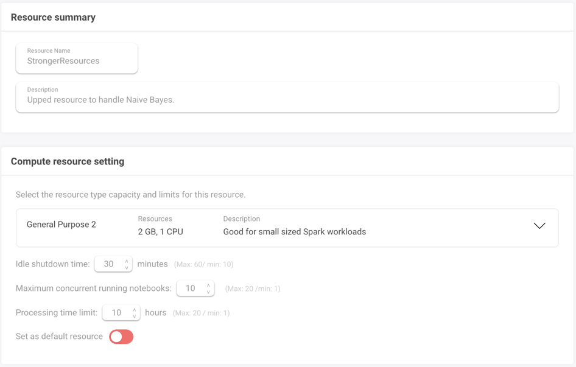
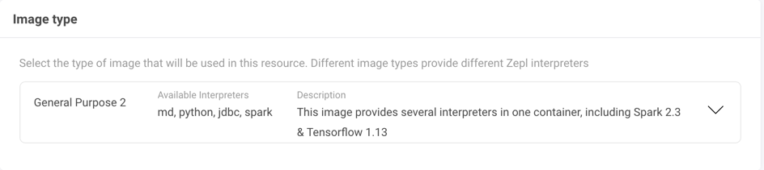
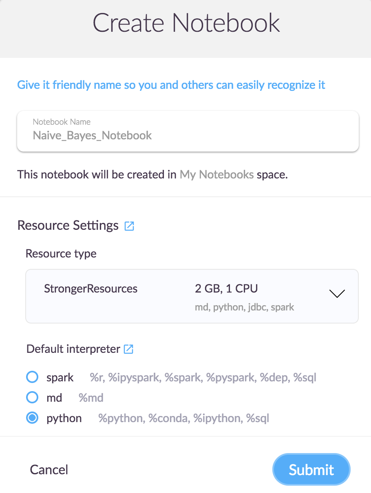

## Unit 22.2 - Big Data in the Cloud

### Overview

Today's class will continue to build on PySpark DataFrames using ZEPL. The goal today is to demonstrate how natural language processing (NLP) works by creating a big data processing pipeline that is used to train a Naive Bayes spam detector.

### Class Objectives

By the end of today's class, students will be able to:

* Explain why NLP is necessary for a big data tool kit.

* Apply transformations resulting from NLP data processing to PySpark DataFrames.

* Explain and utilize PySpark text-processing methods like tokenization, stop words, n-grams, and term and document frequency.

* Describe example steps in an NLP data processing pipeline.

- - -

### Activities Preview
* **PySpark NLP Tokens**
* Files/Instructions::

  * [tokenizing_data.json](Activities/03-Stu_Pyspark_NLP_Tokens/Unsolved/tokenizing_data.json)

  * [data.csv](Activities/03-Stu_Pyspark_NLP_Tokens/Resources/data.csv)

  * [README.md](Activities/03-Stu_Pyspark_NLP_Tokens/README.md)

* **Food Review Stop Words**
* Files/Instructions::

  * [nlp_stopwords.json](Activities/05-Stu_Pyspark_NLP_Stopwords/Unsolved/nlp_stopwords.json)

  * [food_reviews.csv](Activities/05-Stu_Pyspark_NLP_Stopwords/Resources/food_reviews.csv)

  * [README.md](Activities/05-Stu_Pyspark_NLP_Stopwords/README.md)

* **PySpark NLP TD–IDF with HashingTF**
* Files/Instructions:

  * [airline_hashing.json](Activities/07-Stu_Pyspark_NLP_HashingTF/Unsolved/airline_hashing.json)

  * [airlines.csv](Activities/07-Stu_Pyspark_NLP_HashingTF/Resources/airlines.csv)

  * [README.md](Activities/07-Stu_Pyspark_NLP_HashingTF/README.md)

* **Resource Allocation**
* Instructions:
  * Click the **Resources** link on the top right.

    

  * Click **New Resource**.

  * Name the resource and provide a short description.

  * Under Resource Settings, select **General Purpose 2** with 2GB, 1 CPU.

  * Under Image Type, select **General Purpose 2**.

    

    

  * Click **Save**.

  * Navigate to the homepage and create a new notebook.

    

- - -

### Copyright

© 2019 Trilogy Education Services
