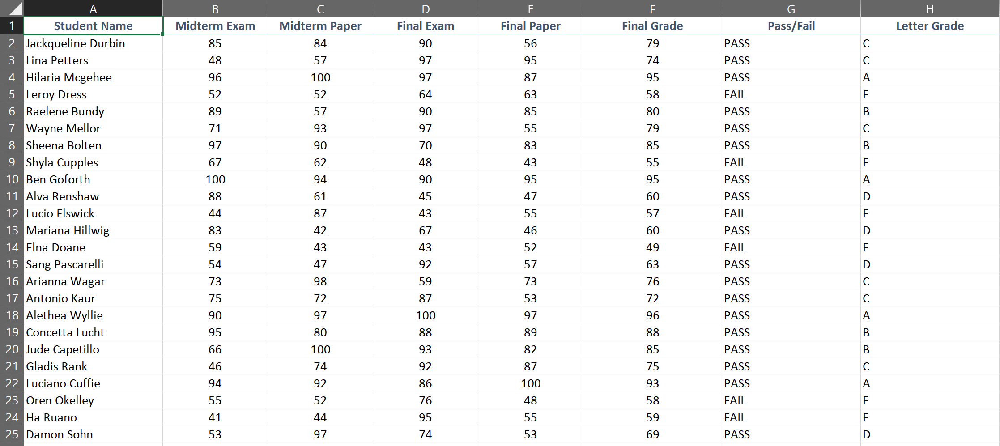

## Unit 1.2 - Egad It's Excel!

### Overview

In this class, students will be introduced to more advanced features in Microsoft Excel such as Pivot Tables, Lookups, and Conditional Formatting.

### Class Objectives

* Students will feel fully proficient in basic Excel navigation and functionality
* Students will gain familiarity with the value of Pivot Tables and the steps for their utilization.
* Students will gain comfort utilizing VLookups and HLookups
* Students will understand how to implement conditional formatting based on logical rules

- - -

### Activities Preview

* **Preclass: Update Excel**

* Check for quick Excel Update. 
  
  * This is more important for Mac users, as a number of key analytics features have been recently ported to the Mac version of Excel.

  

* **Review Color Counter**

  * Reflect on the exercise for a moment or two with the person next to you, then explain the concept and syntax of conditionals in Excel.

* **Gradebook**

* You are tasked with modifying a more complex grade book to determine the letter grades and pass/fail status of a make-believe class.

  

  * File/Instructions:

    * [04-Stu_GradeBook/GradeBook_Unsolved.xlsx](Activities/04-Stu_GradeBook/Unsolved/GradeBook_Unsolved.xlsx)

    * Create a formula which calculates the final grade for a student based upon their previous exams and papers.

    * When making this calculation, every paper and exam should be

      * Considered equal in weight

      * Each one comprising one-fourth of a student's overall grade

      * Round the result to the nearest integer

    * Using conditionals, create a formula that returns `PASS` if a student's final grade is greater than or equal to 60. If the student's final grade is below 60, the formula should return `FAIL`.

  * Bonus:

    * Create a nested `IF()` formula which returns a letter grade based on a student's final grade.

      * Greater than or equal to 90 = `A`
      * Greater than or equal to 80 and less than 90 = `B`
      * Greater than or equal to 70 and less than 80 = `C`
      * Greater than or equal to 60 and less than 70 = `D`
      * Anything less than 60 = `F`

  * Hints:

    * In case you need some help with nested `IF()` statements in Excel, [here](https://support.office.com/en-us/article/IF-function-%E2%80%93-nested-formulas-and-avoiding-pitfalls-0b22ff44-f149-44ba-aeb5-4ef99da241c8) is a support article that goes over how to do so.

* **Apples and Oranges**

* Apples and oranges are two completely different fruits whose data is being stored on two completely different worksheets. In this activity, you will be taking two sheets of data and comparing their values against each other to determine which is the ultimate fruit!

  

  * File/Instructions:

    * [06-Stu_ApplesAndOranges/ApplesAndOranges_Unsolved.xlsx](Activities/06-Stu_ApplesAndOranges/Unsolved/ApplesAndOranges_Unsolved.xlsx)

    * In each of the Apples and Oranges worksheets, calculate the average values of the data contained in each column.

    * Create a new worksheet which will be used to compare some of the characteristics of apples and oranges against each other.

    * Create five columns with the headers 'Durability', 'Ease of Use', 'Taste', 'Juiciness', and 'Aerodynamics.' After creating the five columns, create three rows with the headers 'Apples', 'Oranges', and 'Winner'.

    * Now that we have our basic table, pull in the averages data from the Apples and Oranges worksheets, placing them in their respective cells in our new worksheet.

    * Using a conditional formula, determine whether Apples or Oranges hold the greater average value per column and print which won in the 'Winner' row.

  * Bonus:

    * Write a formula to determine the "overall" winner by counting which has the most wins.

    * Make another worksheet which calculates the averages in the new worksheet itself, as opposed to referencing the averages calculated in the Apples and Oranges worksheets.

* **McDonald's Formatting**

* Despite their attempts to convince people otherwise, the McDonald's menu is not very well known for having the healthiest food options of all time. Looking at a massive table filled with nutrition facts is a pretty daunting task though, so it's up to the class to make this spreadsheet just a little bit easier to understand.

  

  * File/Instructions:

    * [08-Stu_McDonaldsFormat/McDonaldsMenu_Unsolved.xlsx](Activities/08-Stu_McDonaldsFormat/Unsolved/McDonaldsMenu_Unsolved.xlsx)

    * Apply conditional formatting to all values in columns C and D which formats cells based on their values and modifies the color of cells so that lighter shades occur for low values while darker shades occur for high values.

    * Apply conditional formatting to columns F, H, K, M, O, Q, T, U, V, and W which turns a cell green when its value is less than 50 and red when it is greater than or equal to 50.

    * Add a thin-line border to all values in the table.

    * Add a thick horizontal border which underscores the top row of the table.

    * Add a thick vertical border which runs down the right side of column A and apply text-wrapping to all values in that column as well.

  * Hints:

    * If you are wondering how to add borders to a table, check out this [Excel support page](https://support.office.com/en-us/article/Apply-or-remove-cell-borders-on-a-worksheet-dc8a310b-92e3-46a7-9f17-2ab745810f4a) on how to add and remove cell borders.

* **Top Songs Pivot Table**

* Pivot tables are exceptionally helpful when dealing with datasets that are large in scale, but contain enough similarities between data points to find commonalities. For this activity, students will be taking a 5000 row spreadsheet containing data on the top 5000 songs from 1901 onward. The students will be using pivot tables to uncover which artists have the most songs in the top 5000, what they are, and what year they came out.

  

  * File/Instructions:

    * [Top5000Songs_Unsolved.xlsx](Activities/10-Stu_TopSongsPivot/Unsolved/Top5000Songs_Unsolved.xlsx)

    * Select all of the data within your worksheet, then create a new pivot table.

    * Make a pivot table which can be filtered by 'year,' and which contains two rows: 'artist' and 'name'.

    * All of an artist's songs should be listed underneath their name.

    * Update your pivot table to contain values for:

      * How many songs an artist has in the top 5000.

      * The sum of the final_score of their songs.

    * Sort your pivot table by descending sum of the final_score.

* **Product Pivot**

* A small company selling electronics and electronic media has called upon the class to create a table which visualizes the cost of their recent orders. Using lookups, create a pivot table which serves this purpose.

  

  * File/Instructions:

    * [12-Stu_ProductPivot/ProductionPivot_Unsolved.xlsx](Activities/12-Stu_ProductPivot/Unsolved/ProductionPivot_Unsolved.xlsx)

    * Determine the "Product Price" of each row in the "Orders" sheet by using a `VLOOKUP()` that references each row's "Product ID"

      * The "Product Price" of a row does not include shipping

    * Determine the "Shipping Price" of each row in the "Orders" sheet by using a `VLOOKUP()` that references each row's "Product ID"

    * Select all of the data on the "Orders" sheet and create a new pivot table that calculates the sum of both "Product Price" and "Shipping Price" for each "Order Number" and "Product ID"

- - -

### Copyright

Trilogy Education Services © 2018. All Rights Reserved.
